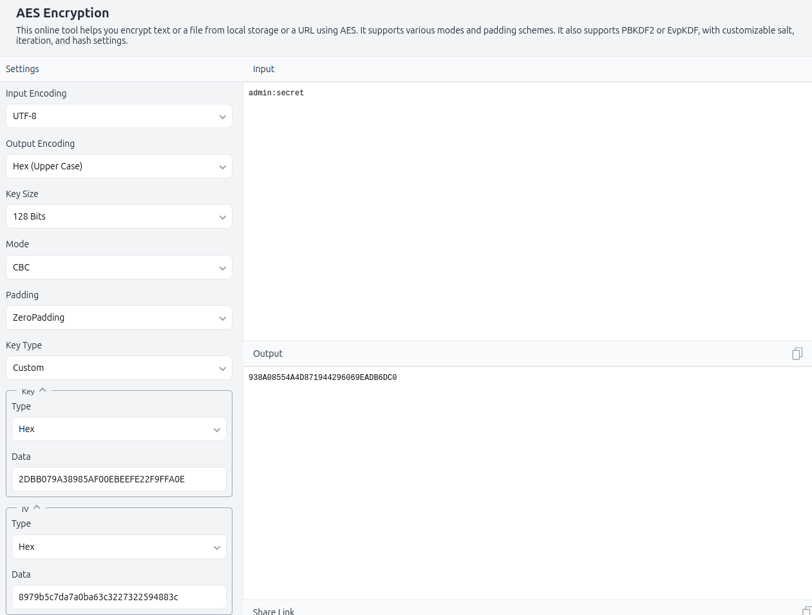
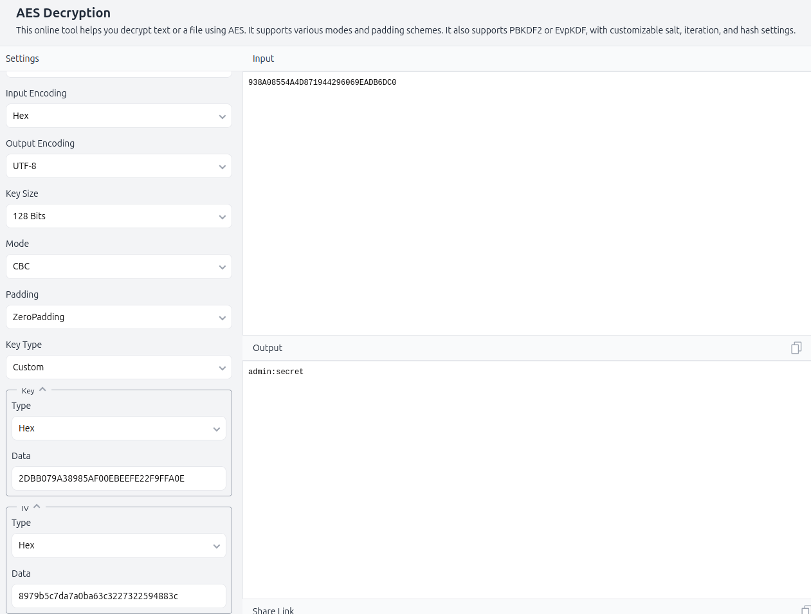
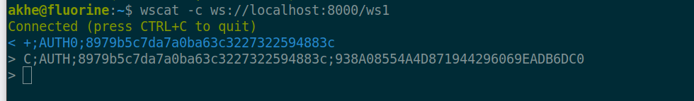

# Debugging

The `AUTH` is used to authenticate a user with a password. The format is

  `C;AUTH;8979b5c7da7a0ba63c3227322594883c;938A08554A4D871944296069EADB6DC0`

the format is

  `C;AUTH;iv;user-password_hash`

where `iv` is a random initialization vector used for encryption, and `user-password_hash` is the encrypted password hash of the user.

The encryption used is AES-128-CBC and is applied over "user:password"

To manually verify the AUTH command, you can use the command line tool `wscat` to connect to the server and send the AUTH command. Typically, you would need to encrypt the password hash using the same method as the server. For this, you can use [this site](https://emn178.github.io/online-tools/aes/encrypt/) and enter information like below:

To verify the decryption, you can use the same site to decrypt the `user-password_hash` using the provided `iv` and the shared secret key.

Then issue the auth command using `wscat` like below:

Normally the sid that is returned when the connection is opened is used as an iv for the encryption. However, this is not necessary, one can use any 16-bit value as the iv.